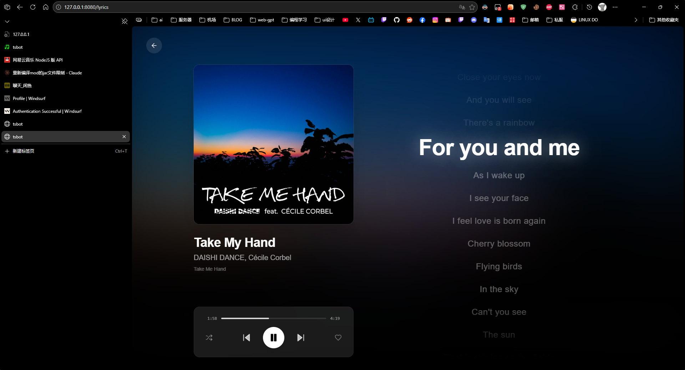
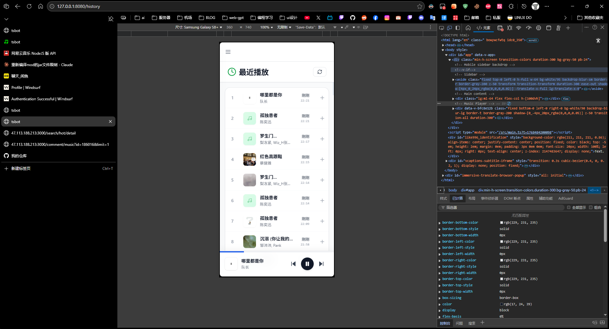
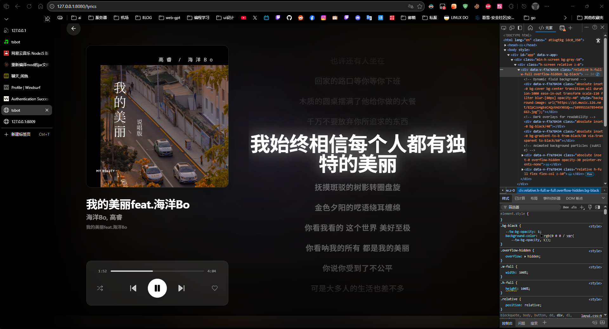
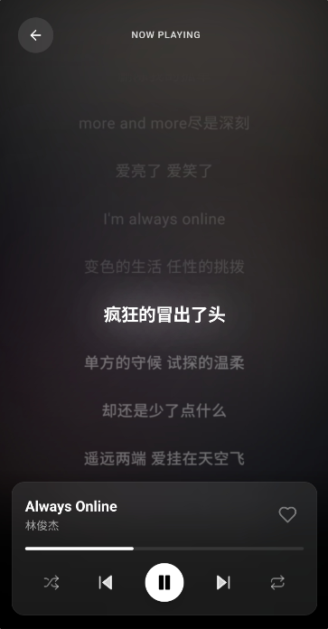
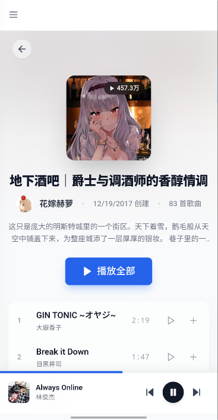

# TSBot (NeteaseTSBot)

[](LICENSE)


[](README.en.md)

TSBot 是一个基于 TeamSpeak 的音乐机器人；`voice-service` 主客户端连接已支持 TS6（历史环境变量名仍保留 `TSBOT_TS3_*`），提供：

- **TeamSpeak 语音播放**（通过 `voice-service` 连接 TeamSpeak 服务器并播放音频；主客户端连接支持 TS3/TS6）
- **播放队列/控制**（暂停/继续/下一首/上一首、音量、随机/循环等）
- **网易云音乐搜索/歌单/喜欢/歌词**（通过外部 `NeteaseCloudMusicApi` 服务）
- **QQ 音乐搜索/歌单/歌词/播放链接**（后端内建适配，登录态能力可通过 Web 控制台配置）
- **Web 控制台**（Vue3 前端，用于搜索/队列/歌词/设置）







## Why TSBot（痛点与目标）

这个项目主要是为了解决旧方案带来的“依赖地狱”和不可维护性。

原有常见组合：

- `TS3AudioBot`
- `NeteaseCloudMusicApi`
- `TS3AudioBot-NetEaseCloudmusic-plugin`

在实践中会遇到：

- **依赖耦合严重**：三者版本/接口/运行方式强绑定，部署和排障成本高。
- **API 难以更新替换**：网易云相关接口经常变化，想替换/升级 API 实现时，改动面会蔓延到 bot 主体或插件。
- **关键插件项目丢失**：`TS3AudioBot-NetEaseCloudmusic-plugin` 在项目完全丢失/不可获取的情况下，整条链路直接断掉，无法继续维护。

TSBot 的目标是把边界重新划清：

- **语音与业务解耦**：`voice-service` 只负责“连接 TeamSpeak + 播放音频”，通过 gRPC 暴露稳定控制接口。
- **网易云作为可替换依赖**：后端通过 `TSBOT_NETEASE_API_BASE` 对接外部 `NeteaseCloudMusicApi`，未来即使要替换/升级，也主要收敛在后端适配层。
- **可维护/可演进**：前端/后端/语音服务三模块独立迭代，减少“一个组件挂了全挂”的情况。

项目由 3 个组件组成：

- **backend/**: Python/FastAPI 后端（队列/搜索/网易云与 QQ 音乐接口/控制语音服务）
- **voice-service/**: Rust 语音服务（连接 TeamSpeak、播放音频，提供 gRPC 给后端调用）
- **web/**: Vue3 + Vite 前端（Web 控制台/播放器 UI）

更多文档：

- `HOWTOSTART.md`（部署/运行指南）
- `LOGGING.md`（统一日志系统）
- `web/README.md`（前端详细说明）

## 系统要求

- **Linux**（推荐 Ubuntu 20.04+）
- **Python**: 3.8+
- **Node.js**: 16+
- **Rust**: 1.70+（用于 `voice-service`）

音乐源依赖说明：

- **NeteaseCloudMusicApi**（仅网易云能力需要；需单独部署 HTTP 服务）
- **QQ 音乐**（后端内建适配；用户歌单和更稳定的播放链接通常需要管理员 QQ 音乐 Cookie）

## 架构概览

```text
   [web (Vue3)]  <--HTTP-->  [backend (FastAPI)]  <--gRPC-->  [voice-service (Rust)]  -->  TeamSpeak (TS3/TS6)
                                 |
                                 | HTTP
                                 v
                        [NeteaseCloudMusicApi]
```

## TeamSpeak / TS6 支持

- `voice-service` 的主客户端连接路径已经适配 TeamSpeak 服务器登录、进频道、收发文字消息和音频播放，当前可用于 TS3/TS6 服务器。
- 为兼容旧配置，环境变量名仍保持为 `TSBOT_TS3_*`，但它们同样用于 TS6 的主客户端连接。
- 代码中仍保留一条可选的 legacy `ServerQuery` fallback，仅用于旧式 `client_description` 更新；它不是 TS6 的 HTTP(S) Query 接口。

## 网易云音乐支持（可选，依赖 `NeteaseCloudMusicApi`）

本项目 **不直接** 调用网易云官方接口；而是通过你自行部署的 `NeteaseCloudMusicApi` 服务转发/封装。

- **NPM**: https://www.npmjs.com/package/NeteaseCloudMusicApi
- **文档**: https://neteasecloudmusicapi.js.org/#/

部署完成后，把服务地址写到环境变量 `TSBOT_NETEASE_API_BASE`（例如 `http://127.0.0.1:3000/`）。

常见部署方式（任选其一，具体参数以官方文档为准）：

```bash
# 方式 A：使用 npx 直接启动
npx NeteaseCloudMusicApi@latest

# 方式 B：使用 Docker（常见镜像：binaryify/neteasecloudmusicapi）
# docker run -d --name ncm-api -p 3000:3000 binaryify/neteasecloudmusicapi
```

建议把该服务部署在 **backend 可访问** 的位置（同机 `127.0.0.1:3000` 或内网地址）。

## QQ 音乐支持（内建）

QQ 音乐能力由后端直接提供，不需要额外部署独立的 QQ 音乐 API 服务。

- 已提供搜索、歌曲详情、歌单详情、歌词、专辑/歌手/MV 信息等接口。
- 播放链接、用户歌单等依赖登录态的能力，通常需要管理员 QQ 音乐 Cookie。
- 管理员可以通过 Web 控制台扫码登录，或调用 `/admin/qqmusic/*` 接口写入/确认 Cookie。

## 快速开始（推荐）

### 1) 配置环境变量

复制模板并修改：

```bash
cp tsbot.env.example tsbot.env
```

你至少需要设置：

- `TSBOT_TS3_HOST` / `TSBOT_TS3_PORT` / `TSBOT_TS3_CHANNEL_ID`（TeamSpeak 连接信息；变量名沿用历史 `TSBOT_TS3_*`）
- `TSBOT_COOKIE_KEY`（用于加密存储管理员 Cookie；务必改成自己的随机字符串）

按音乐源补充设置：

- 使用网易云：设置 `TSBOT_NETEASE_API_BASE` 为你部署的 `NeteaseCloudMusicApi` 地址，例如 `http://127.0.0.1:3000/`
- 使用 QQ 音乐登录态能力：通过 Web 控制台或 `/admin/qqmusic/*` 接口写入管理员 QQ 音乐 Cookie

可选：

- `TSBOT_TS3_SERVER_PASSWORD` / `TSBOT_TS3_CHANNEL_PASSWORD` / `TSBOT_TS3_CHANNEL_PATH`
- `TSBOT_TS3_IDENTITY` / `TSBOT_TS3_IDENTITY_FILE` / `TSBOT_TS3_AVATAR_DIR`
- `TSBOT_ADMIN_TOKEN`：开启后端 admin 接口保护（请求头 `x-admin-token`）
- `VITE_DEV_HOST` / `VITE_DEV_PORT`：前端 dev server 监听地址/端口
- `VITE_API_BASE`：前端请求后端的 Base URL（默认 `http://127.0.0.1:8009`）

### 2) 安装依赖

后端（Python）：

```bash
cd backend
python3 -m venv .venv
source .venv/bin/activate
pip install -r requirements.txt
cd ..
```

前端（Node）：

```bash
cd web
npm install
cd ..
```

语音服务（Rust）：

```bash
# 安装 Rust（如未安装）
# https://rustup.rs/

# 构建 voice-service
make voice-build
```

### 3) 一键启动（nohup，远程部署推荐）

```bash
chmod +x ./nohup-start.sh ./nohup-stop.sh ./nohup-status.sh

# 启动（会分别启动 voice/backend/web，并写日志到 logs/）
./nohup-start.sh

# 查看状态（端口 + 日志路径）
./nohup-status.sh

# 停止
./nohup-stop.sh
```

### 4) 本地开发启动（前台运行）

开 3 个终端分别运行：

```bash
./run-voicemake.sh
```

```bash
./run-backend.sh
```

```bash
./run-web.sh
```

## Docker 部署（新增）

### 1) 准备环境变量

```bash
cp tsbot.env.example tsbot.env
```

至少确认以下配置：

- `TSBOT_TS3_HOST` / `TSBOT_TS3_PORT` / `TSBOT_TS3_CHANNEL_ID`
- `TSBOT_COOKIE_KEY`
- `TSBOT_NETEASE_API_BASE`（如果你在宿主机跑 NeteaseCloudMusicApi，可设为 `http://host.docker.internal:3000/`）

### 2) 构建并启动

```bash
docker compose up -d --build
```

### 3) 查看状态与日志

```bash
docker compose ps
docker compose logs -f backend
```

### 4) 停止

```bash
docker compose down
```

Compose 默认会启动 3 个服务：

- `voice-service`（50051）
- `backend`（8009）
- `web`（5173）

## 默认端口

- **voice-service gRPC**: `127.0.0.1:50051`
- **backend**: `127.0.0.1:8009`（`TSBOT_PORT`）
- **web (Vite dev)**: `127.0.0.1:5173`（`VITE_DEV_PORT`；`tsbot.env.example` 示例是 8080，以你的 `tsbot.env` 为准）

后端 OpenAPI 文档：

- `http://127.0.0.1:8009/docs`

## 管理员登录态（网易云 / QQ 音乐）

### 网易云 Cookie

后端会把“管理员网易云 Cookie”加密存储到数据库（`tsbot.db`）中，用于：

- 获取更稳定的歌曲 URL（避免部分接口匿名受限）
- 访问歌单/喜欢列表等需要登录态的能力

设置方式（需要 admin token 时请带上请求头 `x-admin-token: <TSBOT_ADMIN_TOKEN>`）：

- `POST /admin/cookie`：写入 cookie
- `GET /admin/status`：查看是否已设置
- `GET /admin/account`：验证 cookie 是否有效

前端也提供了设置入口（详见 `web/README.md`）。

### QQ 音乐 Cookie

后端同样会把“管理员 QQ 音乐 Cookie”加密存储到数据库（`tsbot.db`）中，用于：

- 获取更稳定的 QQ 音乐播放链接
- 访问需要登录态的用户歌单、账号信息等能力

设置方式（需要 admin token 时请带上请求头 `x-admin-token: <TSBOT_ADMIN_TOKEN>`）：

- `GET /admin/qqmusic/status`：查看是否已设置
- `POST /admin/qqmusic/cookie`：手动写入 cookie
- `POST /admin/qqmusic/qr/confirm`：确认 Web 扫码登录后写入 cookie

Web 控制台内置了 QQ 音乐扫码登录入口。

## 日志

日志默认写入 `logs/`：

- `logs/backend.log`
- `logs/voice.log`
- `logs/web.log`

详见 `LOGGING.md`（包含 `scripts/log-viewer.sh` / `scripts/unified-logger.sh`）。

## 项目结构

```text
.
├── backend/         # FastAPI 后端
├── web/             # Vue3 前端
├── voice-service/   # Rust 语音服务（gRPC + TeamSpeak）
├── proto/           # gRPC proto 定义
├── data/            # 运行数据/配置（如 config.json）
├── logs/            # 运行日志（启动脚本会自动创建）
├── HOWTOSTART.md
├── LOGGING.md
└── tsbot.env.example
```

## 常见问题

- **web 端口到底是 5173 还是 8080？**
  - Vite 默认是 `5173`（见 `web/vite.config.ts`）。
  - `tsbot.env.example` 示例是 `8080`。
  - `nohup-start.sh` / `run-web.sh` 都会读取根目录 `tsbot.env`，以你实际导出的 `VITE_DEV_PORT` 为准。

- **前端请求报错 / 连不上后端？**
  - 默认后端是 `http://127.0.0.1:8009`。
  - 如果你改了后端地址或端口，在 `web/.env` 或 `tsbot.env` 里设置 `VITE_API_BASE`。

- **后端连不上 voice-service？**
  - 检查 `TSBOT_VOICE_GRPC_ADDR` 是否为 `127.0.0.1:50051`
  - 确保 `make voice-run`/`run-voicemake.sh` 已启动

- **TS6 是不是已经完全支持？**
  - 当前主客户端连接已支持 TS6，连接参数仍沿用 `TSBOT_TS3_*` 命名。
  - 但 legacy `TSBOT_TS3_SERVERQUERY_*` 仍是旧式 ServerQuery fallback，不是 TS6 的 HTTP(S) Query。

## License

See `LICENSE`.
